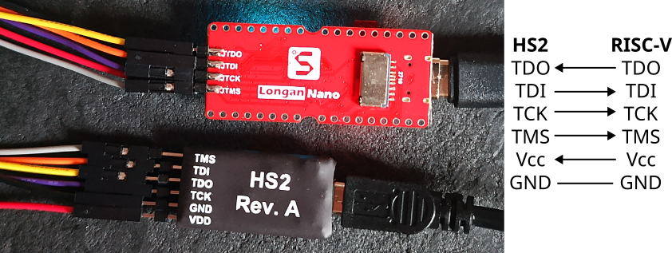
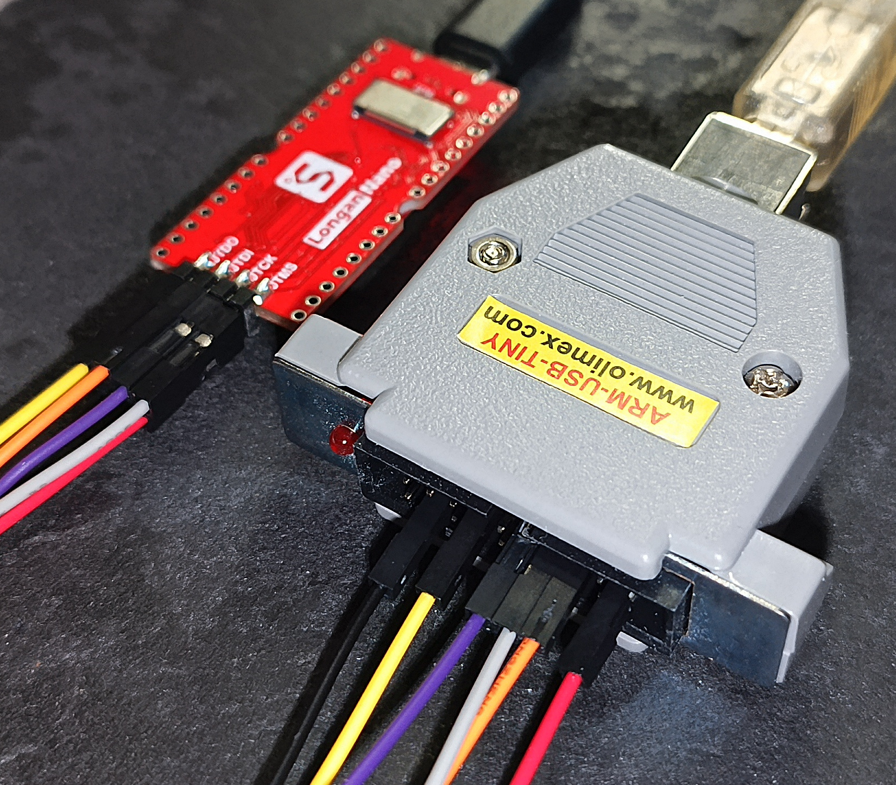
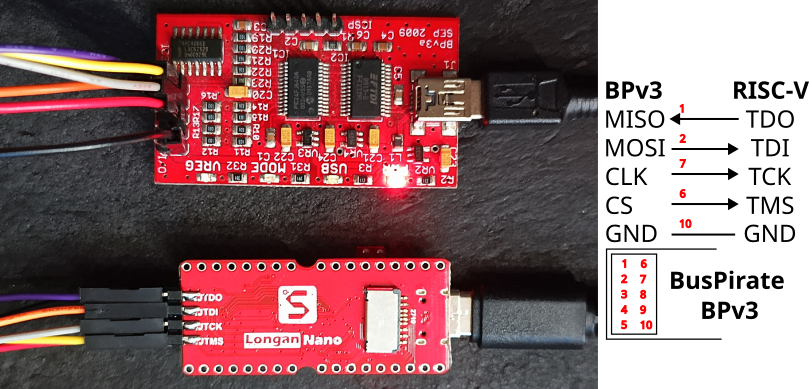

## Script for building a baremetal cross-compilation framework for GNU/Linux targeting ARM, RISC-V and MSP430 cores

Aims at demonstrating that in 2025 it is still possible to compile one's tools despite the continuous changes
in APIs of GCC/Newlib and dependencies. Tested on Debian GNU/Linux sid (Dec. 2024). 

Once completed, make sure to add ``$HOME/sxt/bin`` to your ``$PATH`` to access the cross-compilation toolchain, with ``x`` being ``a`` for ARM, ``m`` for MSP430 or ``v`` for RISC-V

# Dependencies

For OpenOCD:
```
sudo apt install libftdi-dev
```

# Comments on MSP430

For MSP430, we must rely on [TI's opensource tools](https://www.ti.com/tool/MSP430-GCC-OPENSOURCE) to add
linker scripts for the various microcontrollers. While user linker scripts located in ``include/`` directory
is questionable (requires ``-L $HOME/smt/include`` to find the linker scripts), this is where TI/Mitto locates
these files. However a [change in behaviour](https://stackoverflow.com/questions/73429929/gnu-linker-elf-has-a-load-segment-with-rwx-permissions-embedded-arm-project)
of GCC now leads to a linker warning when compiling the example with
```
msp430-elf-gcc -mmcu=msp430f149 -L$HOME/smt/include factorial.c
```
stating
```
msp430-elf/bin/ld: warning: a.out has a LOAD segment with RWX permissions
```
To remove this warning, edit ``$HOME/smt/include/msp430f149.ld`` and add the ``READONLY`` option
to the linker script entry ``.rodata2 (READONLY):``

# Comments on RISC-V

Tested on the Longan Nano board fitted with its GigaDevice GD32VF103. Go to the ``opensource-toolchain-gd32vf103``
submodule and into its ``GD32VF103_baremetal_examples/hello_riscv/``, replace ``riscv-none-`` with ``riscv32-`` in
its ``Makefile``, copy ``factorial.c`` from this repository to overwrite ``main.c`` and ``make`` to generate ``main.elf``
according to
```
riscv32-elf-gcc -x assembler-with-cpp -c -O0 -Wall -fmessage-length=0 -march=rv32imac_zicsr -mabi=ilp32 -mcmodel=medlow -I./../common/device_headers ../common/gd32vf103xb_boot.S -o ../common/gd32vf103xb_boot.o
riscv32-elf-gcc -c -Wall -O0 -g -fmessage-length=0 --specs=nosys.specs -march=rv32imac_zicsr -mabi=ilp32 -mcmodel=medlow -I./../common/device_headers main.c -o main.o
riscv32-elf-gcc -c -Wall -O0 -g -fmessage-length=0 --specs=nosys.specs -march=rv32imac_zicsr -mabi=ilp32 -mcmodel=medlow -I./../common/device_headers ../common/device_headers/n200_func.c -o ../common/device_headers/n200_func.o
riscv32-elf-gcc ../common/gd32vf103xb_boot.o main.o ../common/device_headers/n200_func.o -Wall -Wl,--no-relax -Wl,--gc-sections -nostdlib -nostartfiles -lc -lgcc --specs=nosys.specs -march=rv32imac_zicsr -mabi=ilp32 -mcmodel=medlow -T./../common/gd32vf103xb.ld -o main.elf
```



From there, in a first terminal, assuming the Longan Nano is connected through a Digilent HS2 JTAG probe:
```
openocd -f "interface/ftdi/digilent-hs2.cfg" -f ./riscv_openocd.cfg
```
and in another terminal
```
riscv32-elf-gdb main.elf
target extended-remote localhost:3333
load
break 22
continue
print val
```
returns 120 which is indeed 5!, demonstrating proper execution on the target.



Similarly with an Olimex ARM-USB-TINY JTAG probe (above),

```$ openocd -f "interface/ftdi/olimex-jtag-tiny.cfg" -f ./riscv_openocd.cfg
Info : clock speed 8000 kHz
Info : JTAG tap: riscv.cpu tap/device found: 0x1000563d (mfg: 0x31e (Andes Techn
ology Corporation), part: 0x0005, ver: 0x1)
Info : JTAG tap: auto0.tap tap/device found: 0x790007a3 (mfg: 0x3d1 (GigaDevice 
Semiconductor (Beijing) Inc), part: 0x9000, ver: 0x7)
Warn : AUTO auto0.tap - use "jtag newtap auto0 tap -irlen 5 -expected-id 0x79000
7a3"
Info : datacount=4 progbufsize=2
Info : Examined RISC-V core; found 1 harts
Info :  hart 0: XLEN=32, misa=0x40901105
Info : starting gdb server for riscv.cpu on 3333
Info : Listening on port 3333 for gdb connections
```



Similarly with a Bus Pirate v3 (and *not* v4) (above),

```
$ openocd -f "./buspirate.cfg" -c "transport select jtag" -f riscv_openocd.cfg 
Info : Buspirate JTAG Interface ready!
Info : This adapter doesn't support configurable speed
Info : JTAG tap: riscv.cpu tap/device found: 0x1000563d (mfg: 0x31e (Andes Technology Corporation), part: 0x0005, ver: 0x1)
Info : JTAG tap: auto0.tap tap/device found: 0x790007a3 (mfg: 0x3d1 (GigaDevice Semiconductor (Beijing) Inc), part: 0x9000, ver: 0x7)
Warn : AUTO auto0.tap - use "jtag newtap auto0 tap -irlen 5 -expected-id 0x790007a3"
Info : datacount=4 progbufsize=2
Info : Examined RISC-V core; found 1 harts
Info :  hart 0: XLEN=32, misa=0x40901105
Info : starting gdb server for riscv.cpu on 3333
Info : Listening on port 3333 for gdb connections
```

REMEMBER!
=========
THE RESULTING TOOLCHAIN IS FOR BARE BONE ARM PROCESSOR SOFTWARE. NOT FOR USE
WITH GLIBC OR THE LINUX KERNEL. DO NOT EVEN BOTHER TO ASK FOR THAT!

To compile the ARM toolchain for barebone ARM devices:
======================================================
* git clone https://github.com/master-elise/summon-arm-toolchain.git

Command line options
====================

You can suffix the script call with the following variable parameters:

TARGET=
-------

By default the target is arm-none-eabi, you may want to use a different target, for example arm-elf. Use that option on your own risk it may brake things.

PREFIX=
-------

By default the installation prefix is "$(HOME)/sat" you can change it to "/usr" then the binaries will be installed into "/usr/bin" and the toolchain specific
files in "/usr/arm-none-eabi" assuming you did not change the TARGET variable.

SUDO=
-----

By default this variable is empty. If you need root rights for the install
step you may set this variable to "sudo".

  $ ./summon-arm-toolchain SUDO=sudo

This will prefix all make install steps with the sudo command asking for
your root password.

QUIET=
------

By default set to 0. To decrease console output (may increase compile speed
in some cases) you can set this variable to 1.

USE_LINARO=
-----------

By default set to 1. To disable the usage of the Linaro GCC and use of the
vanilla GCC instead set to 0.

OOCD_EN=
--------

By default set to 1. To disable compilation of OpenOCD JTAG programming
software set to 0.

LIBSTM32_EN=
------------

By default set to 0. To enable compilation of the non-free libstm32 library
set to 1.

LIBOPENCM3_EN=
----------------

By default set to 1. To disable compilation of the open source libopencm3
library set to 0.

DEFAULT_TO_CORTEX_M3=
---------------------

By default set to 0. To enable compilation of binutils and GCC to generate code
for the Cortex-M3 ARM architecture by default set to 1. Tests have shown that
using these options is not very reliable and is discouraged. It is more
reliable to add the necessary options to your build environment instead.

CPUS=
-----

Overrides the autodetection of CPU cores on the host machine. This option
is translated into the -j$CPUS+1 option to the make command when running
the script.

Example:
--------

  $ ./summon-arm-toolchain LIBSTM32_EN=1 CPUS=5

This will run the script with libstm32 enabled and with 5 CPUs on your host
machine resulting in calling all make commands with -j6.

Currently tested and known to work target platforms:
====================================================

* STM32F10x (Olimex STM32-H103 eval board, Open-BLDC v0.1, v0.2, v0.3, v1.0)

Currently tested and known to work host platforms:
==================================================

* Linux 64bit (Debian unstable)

Notes for Linux users:
====================== 
You need to install several packages. On Debian just run:

  $ apt-get install flex bison libgmp3-dev libmpfr-dev libncurses5-dev \
    libmpc-dev autoconf texinfo build-essential libftdi-dev zlib1g-dev \
    git zlib1g-dev python-yaml

You may want to try running the following command instead too:

  $ apt-get build-dep gcc-4.5 git zlib1g-dev python-yaml

For XML support in gdb you may want to install libexpat1 and libexpat1-dev too. 

Usage notes:
============

We support multilib now in SAT thanks to Eric Parsonage's and Bernard
Davison's amazing work. You want to use the following GCC flag combinations to
generate full fledged floating point supporting code for some selected
architectures (default is to use software floating point).

* ARM7TDMI-S targets: -mthumb -mcpu=arm7tdmi-s
* Cortex-M0 targets: -mthumb -mcpu=cortex-m0
* Cortex-M3 targets: -mthumb -mcpu=cortex-m3
* Cortex-M4 targets: -mthumb -mcpu=cortex-m4 -mfloat-abi=hard -mfpu=fpv4-sp-d16

If you need support for some other ARM MCU and know the parameters for it,
just drop us a line and we will add that combination to the multilibs.

You can list available combinations by running:

  $ arm-none-eabi-gcc -print-multi-lib

Stable tarball downloads and GIT cloning
========================================

The script has a section containing version numbers of the respective packages.
Some packages have beside the stable release version number also a variable
with the suffix _GIT. If that variable is set to either a branch name or a
revision SHA the script will try to clone the repository and checkout the
respective branch or SHA instead of downloading the stable version.

If you provide a GIT branch name the script will contact the GIT server and
query the associated SHA. If this SHA is already present in the sources
directory it will not attempt to reclone the repository.
